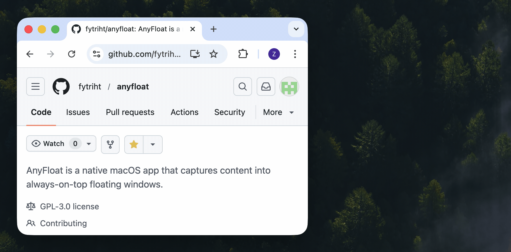
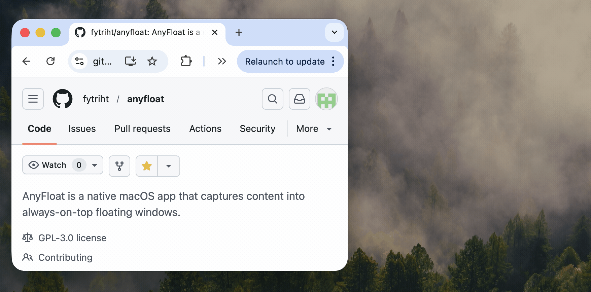
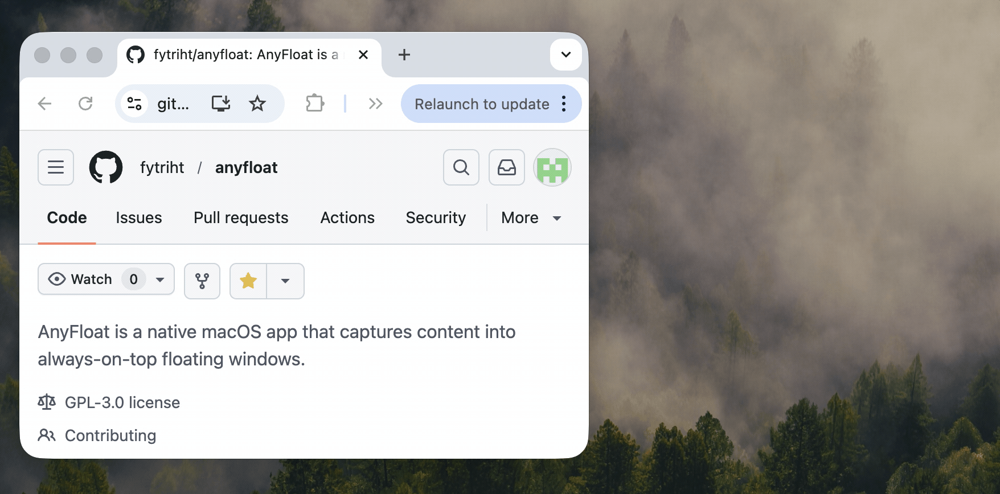
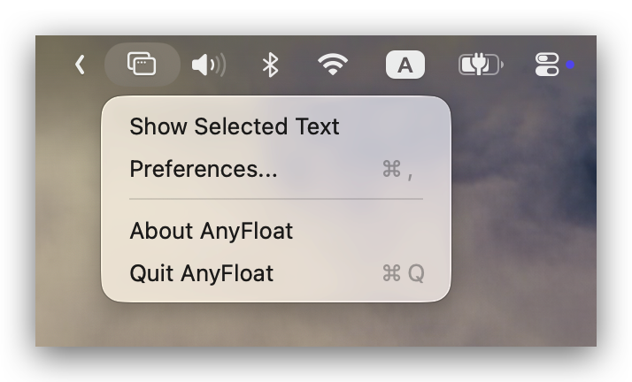

AnyFloat is a native macOS app that captures text 
into always-on-top floating windows.

<a href="https://github.com/fytriht/anyfloat/releases">Download from Releases</a>
<!-- [Download from Releases](https://github.com/fytriht/anyfloat/releases) -->

<figure>
  
  <figcaption>
    Trigger the hotkey to capture selected text
  </figcaption>
</figure>

<table>
  <tr><td>Trigger the hotkey to capture selected text </td><td></td></tr>
  <tr><td>Supports multiple floating windows</td><td></td></tr>
  <tr><td>With no selection, the hotkey opens a blank quick-note panel</td><td></td></tr>
</table>

## Why AnyFloat?

1. Quickly capture snippets for later reference without frequent context switching.
2. When juggling multiple parallel tasks, open a blank window to jot down ideas instantly.
3. Unlike Apple Notes, it is super lightweight and keeps a persistent floating window within reach.

## Quick Start

1. Download from [Releases](https://github.com/fytriht/anyfloat/releases).
2. Launch AnyFloat.
3. Select text in any app.
4. Press `Shift + Option + F`
5. You can always find AnyFloat in the menu bar.
    > 

## Troubleshooting

- Hotkey does not trigger:
  - Check shortcut conflicts with other tools
  - Relaunch AnyFloat
- Selected text is not captured in some apps:
  - Confirm Accessibility permission is enabled for `AnyFloat`
  - If you just granted Accessibility permission, relaunch AnyFloat once.

## Contributing

For developing and contributing workflow, see [`CONTRIBUTING.md`](CONTRIBUTING.md).
